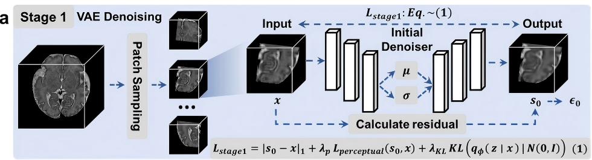
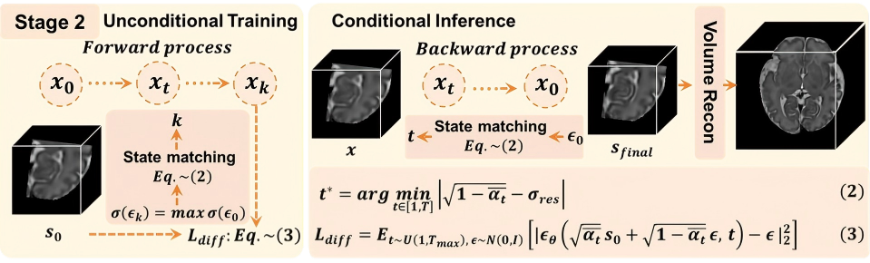

# FetMRIE: Fetal Brain Magnetic Resonance Image Enhancement without Clean Reference

**Official Implementation — Under Review at Medical Image Analysis (MedIA)**

---

## Overview

**FetMRIE** is a fully unsupervised framework for enhancing fetal brain MRI slices. It improves tissue contrast and visual clarity while preserving anatomical structures critical for clinical assessment (cortical folds, cerebellar boundaries, vermis contours).

The framework operates in two stages:

<table>
  <tr>
    <td align="center" width="50%">
      <br/>
      <b>Stage 1: Latent-Space Initial Denoising</b>
    </td>
    <td align="center" width="50%">
      <br/>
      <b>Stage 2: Adaptive Diffusion Structural Restoration</b>
    </td>
  </tr>
</table>

- **Stage 1**: A VAE trained on high-quality fetal brain MRI performs initial denoising in the latent space, suppressing acquisition noise while retaining global anatomical layout.
- **Stage 2**: A pre-trained DDPM with an adaptive state-matching mechanism automatically estimates the optimal forward diffusion step for each slice, enabling case-specific structural restoration without manual tuning.

---

## Key Features

- **Fully Unsupervised** — No paired or annotated training data required
- **Two-Stage Pipeline** — VAE denoising → Diffusion-based restoration
- **Adaptive State Matching** — Per-slice noise level estimation via cosine similarity in latent space
- **Anatomical Fidelity** — Preserves cortical folds, tissue boundaries, and fine cerebellar structures
- **Biometry Ready** — Enhanced images improve downstream automated biometry (TCD, VAD, VH)

---

## Code & Weights

The complete source code has been provided. Parts of the codebase are built upon [MONAI](https://github.com/Project-MONAI/MONAI) — we gratefully acknowledge their work.

Pre-trained model weights will be released upon paper acceptance.

## Usage

```bash
# Train Stage 1 (VAE)
python train_first_stage.py
# Train Stage 2 (DDPM)
python train_second_stage.py
# Testing
python test_all.py
```


